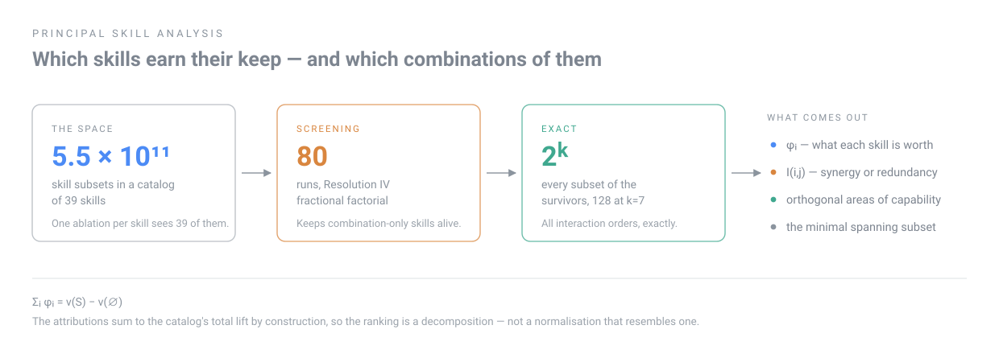

<div align="center">

# PSA — Principal Skill Analysis

**Which parts of an agent skill collection actually earn their keep — and which combinations of them?**

[](https://github.com/rasputin28/principal-skill-analysis/actions/workflows/tests.yml)
[](pyproject.toml)
[](LICENSE)
[](paper.md)

[**Methodology**](METHODOLOGY.md) · [**Paper**](paper.md) · [**Design document**](docs/superpowers/specs/2026-09-06-psa-design.md) · [**Pre-registration**](preregistration/) · [**Catalog selection**](preregistration/catalog-selection.md)



</div>


Everyone publishes a harness. Everyone claims it helps. Nobody measures which *parts* of it
help, whether any part is doing nothing, or whether two authors' collections can be compared at
all. That is an empirical question being settled by assertion.

PSA is the instrument for settling it by measurement. You point it at a skill collection — any
repository, any author, pinned to a commit — and it returns the marginal contribution of each
skill with a confidence interval, the contribution of skills *in combination*, and a comparison
against any other collection on a common baseline.

> **Status: pre-registration. No results yet.**
> The methodology, the design generator, the estimator and the controls are implemented and
> tested. No measurement run has been executed. `paper.md` is a Stage 1 Registered Report:
> hypotheses and analysis plan are fixed before data collection, deliberately.

---

## Terms

**Skill**, one written instruction file an agent can load. **Catalogue**, a set of them pinned to a
repository and revision. **Configuration**, the subset made available for one attempt at one task —
possibly empty, possibly all of them. **Run**, one attempt: one agent, one task, one configuration.
**Lift**, how much better the agent does with the whole catalogue loaded than with none of it.

Everything else technical is defined where it first appears, here and in
[METHODOLOGY.md](METHODOLOGY.md).

## The logic, in order

Every step is forced by the failure of the one before it. Nothing here is decorative.

**1. The quantity is the lift**, `v(S) − v(∅)`: how much better the agent does with the collection
loaded than without. Every author reports a version of this. The question is how it is produced.

**2. Ablation cannot answer that.** Remove one skill and measure the loss, and a skill that
contributes nothing looks exactly like a skill that contributes only alongside another — in both
cases the rest of the collection compensates. Those two cases imply opposite decisions.

**3. So a skill must be evaluated in many contexts.** Its worth is the average of its marginal
contributions across the coalitions it might join.

**4. Requiring that average to be *fair* pins it down uniquely.** A skill contributing nothing
gets exactly zero; interchangeable skills get the same; and the attributions sum exactly to the
total lift. One allocation satisfies all three — the **Shapley value**. That last property,
efficiency, is what makes the ranked chart a real decomposition rather than a normalisation that
resembles one.

```
φᵢ = Σ_{C ⊆ S\{i}}  [ |C|! (N−|C|−1)! / N! ] · [ v(C ∪ {i}) − v(C) ]
```

The paper derives this rather than citing it: the weights come from counting how many orderings
give a skill exactly that set of predecessors, and additivity is a three-line telescoping proof.
Linearity is the property usually disputed, so it is worth knowing it can be dropped — Young
(1985) replaces it with monotonicity and the same estimator is again the unique one. Two
independent routes to the same place is better evidence than either alone.

**5. But that needs every subset, and there are `2^N` of them.** The `2` is not a pair — it is a
switch: each skill loaded or not, two states per skill. At 39 skills that is 5.5 × 10¹¹
configurations.

**6. The exponential barrier belongs to enumeration, not to the problem.** Rewrite the value
function in terms of *dividends* — the part of a combination's worth that no smaller combination
accounts for. That rewriting is exact and unique, and a skill's score turns out to be the sum of
the dividends of every combination containing it, split equally among its members. So **if no
combination bigger than `t` skills has a non-zero dividend, the whole thing is determined by
`O(N^t)` numbers: 781 instead of 5.5 × 10¹¹ for pairs at 39 skills.** Nothing is approximated —
inside the assumption the answer is exact. What is paid is the assumption, and the assumption gets
tested against configurations held out of the fit rather than trusted.

**7. How many runs that takes has a proved answer:** a design recovers every effect up to order `t`
if and only if its resolution is at least `2t+1`. All pairs means resolution 5. A cheaper screening
route stays available for smaller budgets, and it must not kill the skills we are hunting. Running only part of the possible
configurations costs you something: some effects become impossible to tell apart no matter how much
data you collect, because they produce the same pattern across the runs. That confusion is called
*aliasing*, and which effects get confused is what *resolution* names. At Resolution III a skill's
own effect is confused with the effect of a *pair* — and a skill that only works alongside one
other **is** a pair effect, so it can cancel to zero and be dropped. Resolution IV, bought by
running the design a second time with every choice reversed, keeps every skill's own effect clean.
It costs double, and the skills this project exists to find are the ones the cheap option loses.

**8. The exact stage measures every order at once.** At `k = 7` its 128 configurations are 1 empty
baseline, 7 singles, **21 pairs**, 35 triples, 35 quadruples, 21 quintuples, 7 sextuples and the
full set. Pairs are one size among many — the design is not pairwise.

**9. A number per skill throws that away**, so PSA also measures every pair: how much the worth of
one skill changes depending on whether the other is loaded. **10. A number per pair does not
scale** — 39 skills means 741 pairs, which is a spreadsheet, not a decision. Those pairwise numbers
form a symmetric table, and a symmetric table can be rewritten as a handful of mutually independent
directions through the space of skills. Those are the *areas*. Keeping the best skill in each area
gives the minimal spanning subset. **11. All of it is noise-limited before it is budget-limited**, so comparisons are blocked
on task. **12. And all of it is unattributable without calibration**, so the placebo and the
invocation record run before anything of interest.

The exact procedure is specified in [METHODOLOGY.md](METHODOLOGY.md); the argument for it is
[the paper](paper.md).

## Combinations, not just skills

A per-skill number cannot say whether skill 1 is better paired with skill 3 than with skill 2 —
the Shapley value averages over coalitions and then collapses them. PSA keeps the structure and
reports it:

```python
estimate.interaction_index_by_task(values, skills)   # synergy (+) vs redundancy (-), every pair
estimate.compare_coalitions(values, ["s1","s3"], ["s1","s2"])   # the literal question, with a CI
estimate.best_coalitions(values, size=3)             # given room for three, which three
```

Negative interaction is the expected case and the one nobody reports: two skills that do the
same job, both loaded, spending context to buy what one already bought. Hypothesis H6 says
published catalogs are subadditive for exactly this reason.

### From 741 pairs to a decision

Pairwise numbers do not scale into a decision: 39 skills means 741 pairs. Collect them into a table
with one row and column per skill. Since the interaction of A with B is the same as B with A, the
table is symmetric, and a symmetric table can be rewritten as a set of mutually independent
directions with a number attached to each (its *eigendecomposition*). The most negative of those
directions name the areas where a catalogue has piled several skills onto one job:

```python
structure = estimate.redundancy_axes(interaction, skills)
estimate.minimal_spanning_subset(structure, phi)   # one per area; the rest is context cost
```

The reading is algebraic, not interpretive: a block of `m` mutually redundant skills interacting
pairwise at `-c` yields an eigenvalue of `-c(m-1)` with a uniform eigenvector over the block, which
is asserted in `tests/test_estimate.py::test_redundancy_axes_recover_a_planted_block`.

Orthogonality here is *imposed by the method, not discovered in the data*. These are the
orthogonal directions that best account for the observed redundancy; they are not evidence that
capabilities are orthogonal.

The exact stage runs every subset of the surviving skills, so all of this comes out of the same
runs at no extra cost. The screening stage deliberately does not identify pairs — Resolution IV
separates main effects from two-factor interactions but leaves those aliased with each other —
and it does not need to, because a skill whose entire value is a pairwise interaction still
shifts the marginal mean in a balanced design and therefore survives to the stage that can
measure it.

## How it stays affordable

The subset space is `2^N`. Two stages plus a validation pass:

| Stage | Design | Configurations at N=20 |
|---|---|---|
| **Primary** | bounded order `t=2`, design of resolution 5, whole catalogue | 781 |
| Fallback: screening | Resolution IV (Plackett–Burman + foldover) | 80 |
| Fallback: exact | full factorial over the `k` survivors | 128 at `k=7` |
| Validation | permutation sampling over the whole catalogue | budgeted |

Resolution IV, not III: Resolution III aliases main effects with two-factor interactions, and a
two-factor interaction *is* a skill that only works in combination — the phenomenon this tool
exists to detect. Halving the screening budget by aliasing it away would defeat the study.
`tests/test_design.py::test_foldover_actually_buys_resolution_iv` asserts the property rather
than trusting it.

Noise is handled by **pairing on task**, not by buying more runs: same task, same seed, same
model, only the configuration varies, and the analysis works on within-task differences. Task
difficulty is the dominant variance component on SWE-bench-style benchmarks, and blocking on it
is what turns an intractable sample size into a tractable one.

## Controls

An attribution without these is a number of unknown provenance. The placebo in particular is
required by known results, not adopted as hygiene: semantically equivalent reformattings of a
prompt move accuracy by tens of points (Sclar et al., ICLR 2024), and position inside a long
context changes whether information is used at all (Liu et al., TACL 2024). Loading any skill
changes both.

- **Length-matched placebo.** Loading a skill lengthens the prompt. `psa.controls.make_placebo`
  writes an inert skill matched to the catalog's median length. Its `φ` must have a confidence
  interval containing zero — if it does not, the run set reports nothing.
- **Saboteur.** A deliberately harmful skill that must come out significantly negative. An
  instrument that cannot detect sabotage cannot be trusted to detect improvement.
- **Availability versus invocation.** Skills load by descriptor; the agent decides whether to
  use them. The ledger records both, and the report gives intention-to-treat *and*
  effect-among-invoked. A well-written skill that never triggers is worth nothing in practice.
- **Contamination.** Attribution ordering is re-checked on post-cutoff tasks. If it does not
  transfer, the finding was memorization, and that is what gets reported.

## Install

```bash
git clone https://github.com/rasputin28/principal-skill-analysis && cd principal-skill-analysis
python3 -m venv .venv && ./.venv/bin/pip install -e ".[dev]"
./.venv/bin/python -m pytest -q
```

## Use

```bash
# 1. pin a catalog — any repo of SKILL.md files, yours or someone else's
psa catalog ~/some-published-skills --out results/catalog.json

# 2. emit the run matrix
psa design results/catalog.json --stage screening --out results/design.json

# 3. execute (your harness, behind psa.runner.Runner) and append to the ledger

# 4. compute attributions from the ledger alone
psa estimate results/ledger.jsonl --out results/report.md
```

Step 4 never touches a model or a network. That boundary is deliberate: anyone can recompute
every number in the paper from the published ledger, without re-running a single agent, and
under a different estimator if they disagree with ours.

## Supporting a harness

`psa.runner.Runner` is a four-method protocol: prepare, run, return outcome, report which skills
were invoked. Implement it and your harness is measurable. A harness that cannot report
invocation is declared unsupported rather than approximated — without it, availability and
effect are indistinguishable.

`StubRunner` produces deterministic hashes so the pipeline can be exercised end to end before
any budget is spent. `psa.report.guard` refuses to turn a stub ledger into a result.

## Layout

```
psa/design.py      Hadamard construction, screening designs, full factorial
psa/estimate.py    exact + sampling Shapley, paired bootstrap, latent axes
psa/catalog.py     skill discovery and commit pinning
psa/compile.py     hermetic per-configuration workspaces
psa/ledger.py      the run record; the execution/analysis boundary
psa/controls.py    placebo and saboteur
psa/report.py      report cards that state failed controls rather than omitting them
paper.md           Stage 1 Registered Report
docs/superpowers/specs/  design document
```

## Prior work, and what is actually new here

Scoring an agent's components by their average contribution across combinations is not new, and the
closest results are stated here rather than left for a reader to find. [Yang et al.
(2025)](https://arxiv.org/abs/2502.00510) score workflow modules this way across seven task
families. [Liu (2026)](https://arxiv.org/abs/2605.05716) runs all 32 combinations of five
scaffolding components, computes the same scores exactly, reports pairwise and three-way
interactions, and finds that switching everything on is worse than switching on a subset. [Li et
al. (2026)](https://arxiv.org/abs/2608.04562) score the parts inside a single skill, holding prompt
length constant to separate content from context cost. [Liu et al.
(2026)](https://arxiv.org/abs/2608.13173) attribute value to steps within a skill.

Three gaps remain, and they are what this repository is for.

**Scale.** All of that work covers four or five modules chosen by the experimenter, or the parts of
one skill. At that size you can simply run every combination, so there is no problem of reaching a
catalogue too large to enumerate without discarding the skills that only work in company. A real
published catalogue has 39.

**Offered versus used.** In those designs a component is wired in: if the memory module is on, it
runs. A skill offered by a one-line descriptor may never be invoked. None of that work records
which, so none of it can tell a bad skill from an unused one.

**Catalogues as input.** None of it takes a published collection as an argument, so none can
compare one author's collection against another's on a shared baseline, which is the comparison a
practitioner actually faces.

The subadditivity result is therefore a **replication** in this repository, not a discovery. Liu
found it first, at five components on reasoning benchmarks; the open question is whether it holds
at an order of magnitude more components, on code, in collections people install.

## Citing

The written methodology is the reference for this repository; the code is its implementation.

```bibtex
@misc{suro2026psa,
  author = {Suro, Joel},
  title  = {Principal Skill Analysis: Attributing Agent Performance to
            Individual Skills and Their Combinations},
  note   = {Registered Report, Stage 1},
  year   = {2026},
  eprint = {XXXX.XXXXX},
  archivePrefix = {arXiv},
  url    = {https://arxiv.org/abs/XXXX.XXXXX}
}
```

The arXiv identifier is a deliberate placeholder: **this preprint has not been posted yet**, and
`XXXX.XXXXX` is written out rather than given a plausible-looking number so that no reader or
citation manager mistakes it for a real record. It is replaced on posting; tracked as `PSA-on5`.

Prior work by the author: *Semantic Tokens in Retrieval Augmented Generation*,
[arXiv:2412.02563](https://arxiv.org/abs/2412.02563).

## Authorship

The methodology is the work of **Joel Suro**, developed with the support of a large language model
used as a working instrument — to formalise arguments, implement and test the estimators, draft
prose, and argue against weak choices. Several corrections to the design came out of that
exchange. The author takes full responsibility for the content. See *Author contributions and
tooling* in [`paper.md`](paper.md) for the full disclosure and why a study of this particular
subject owes the reader one.

## License

MIT for the code. The paper is CC BY 4.0.
